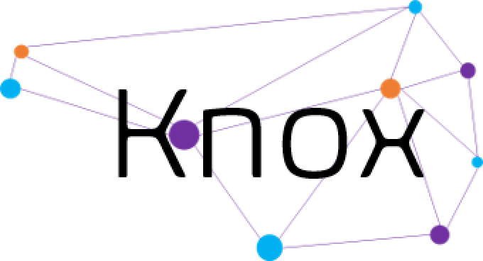

  

# Knox - A Genetic Design Space Repository

## Quickstart

### Docker Instructions
1) Install [Docker Compose](https://docs.docker.com/compose/install/)
2) Clone this repository 
3) Run `docker-compose up --build` in the root directory of this repo
4) Open Knox web interface at http://localhost:8080

### Non-Docker Instructions
1) Install [Java 17+](https://www.oracle.com/java/technologies/javase/jdk17-archive-downloads.html)
2) Set "JAVA_HOME" Environment Variable Path
3) Install [Neo4J Desktop 2](http://neo4j.com/download)
4) Open the Desktop app and click "Create instance"
5) Set Instance name to "knox"
6) Set Neo4j version to 2025.07.1
7) Database user should be neo4j
8) set password to "*kn0xkn0x*"
9) then click "Create"
10) Click "Start instance"
11) [Download](https://maven.apache.org/download.cgi) and [Install](https://maven.apache.org/install.html) Maven
12) Clone this repository
13) Run `mvn clean install` in the root directory of this repo
14) After successful install, Run `mvn spring-boot:run` in the root directory of this repo
15) Open Knox web interface at http://localhost:8080

## AI Chat / Agent Integration

### Setup
1) Get an API-key from [OPENAI](https://platform.openai.com/api-keys)
2) Place API-key in [application.properties](src/main/resources/application.properties) file (Non-Docker Setup)
3) You can then run the application and use the AI features via the AI Chat

## Manuscript

Nicholas Roehner, James Roberts, Andrei Lapets, Dany Gould, Vidya Akavoor, Lucy Qin, D. Benjamin Gordon, Christopher Voigt, and Douglas Densmore. GOLDBAR: A Framework for Combinatorial Biological Design. ACS Synthetic Biology Article ASAP (2024). 

DOI: https://pubs.acs.org/doi/full/10.1021/acssynbio.4c00296

## Screen Shots

  Design Spaces are represent as directed graphs

  

  The Design Space above was created using the following GOLDBAR specification

  

